## 스펙
* Spring Boot 3.2.1
* Spring Security
* java 17
* JPA, H2
* Gradle
* yaml
* lombok
* Swagger

## Swagger url
* http://localhost:9000/swagger-ui/index.html

## H2 Embeded DB
* http://localhost:9000/h2-console
* url: jdbc:h2:mem:testdb
* login: sa
* pw:

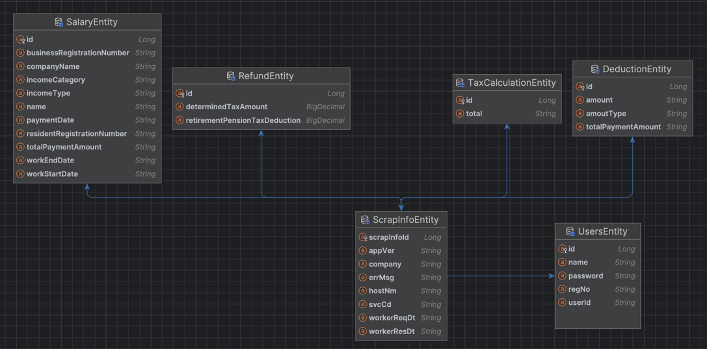

---

## 요구사항
##### 1.사용자가 삼쩜삼에 가입 또는 로그인 - (완료)
##### 2.가입한 유저의 정보를 스크랩 하여 환급액이 있는지 조회. - (완료)
##### 3.조회한 금액을 계산한 후 유저에게 실제 환급액을 알려줌- (완료)

#
#
# 구현
#### 1. 회원가입 API : /szs/signup
* 특정회원 5명에 대해서만 가입하도록 조건 추가
* pw: Bcrypt 단방향으로 암호화
* 주민번호: AES256 암복호화 한다.

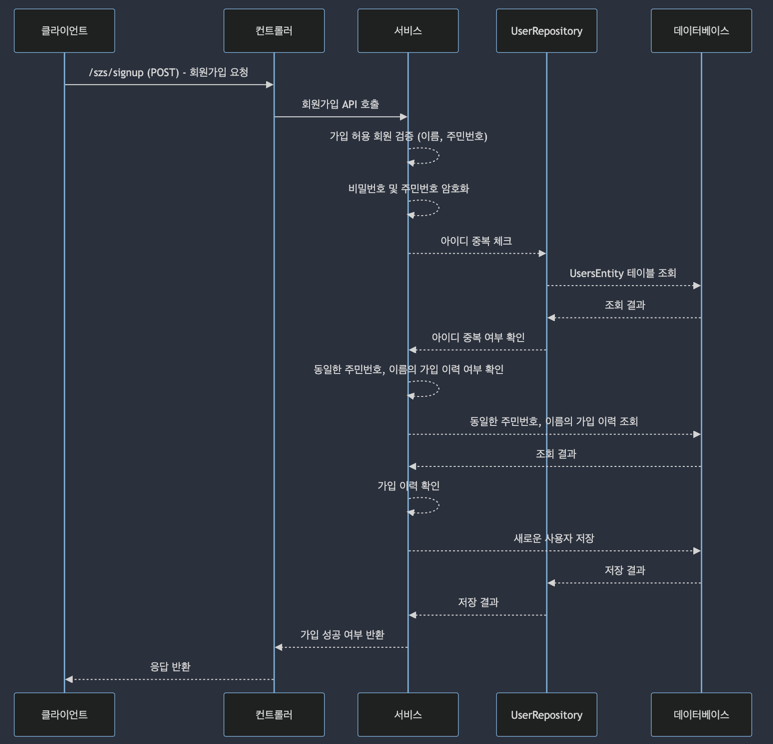

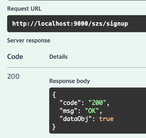

#
#
#### 2. 로그인 API : /szs/login
* Bcrypt로 입력받은 pw검증
* 로그인 성공시 USER 권한의 JWT Token 발급 (유효시간 1일)
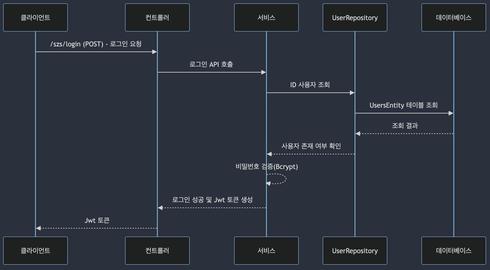
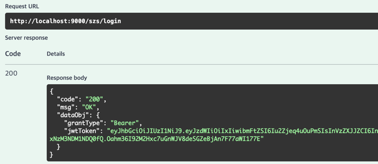

#
#
#### 3. 회원정보 API : /szs/me
* 로그인시 발급받은 토큰의 정보로 회원정보 조회
* JwtAuthenticationFilter를 통해 토큰 검증 및 인증
* 토큰 검증 실패시 "HTTP 401 : Unauthorized" 발생
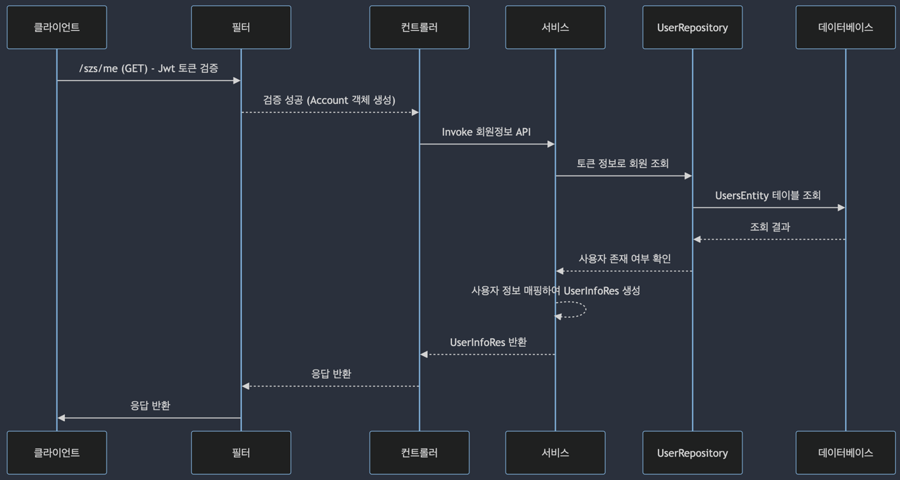
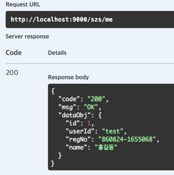

#
#
#### 4. 회원정보 Scrap API : /szs/scrap
* 로그인시 발급받은 토큰의 정보로 회원정보 조회
* JwtAuthenticationFilter를 통해 토큰 검증 및 인증
* 제공받은 스크랩API 외부url 호출하여 정보 저장
* 스크랩정보 저장과 동시에 환급금액 계산하여 Table: refund 저장. 
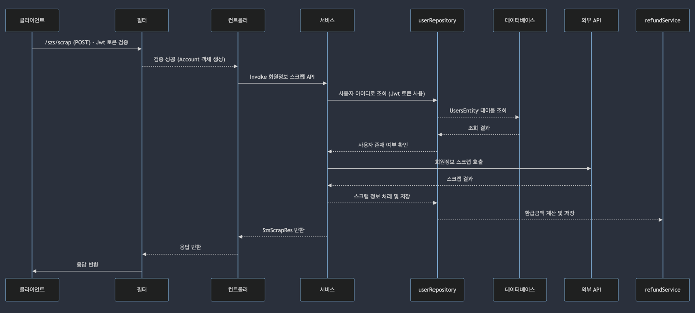
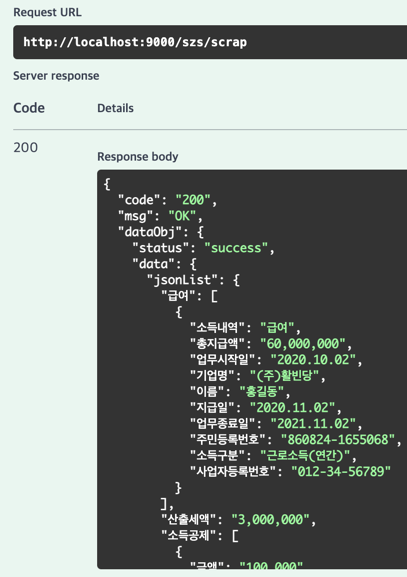

#
#
#### 5. 환급조회 API : /szs/refund
* 로그인시 발급받은 토큰의 정보로 회원의 환급액 조회
* JwtAuthenticationFilter를 통해 토큰 검증 및 인증
* 스크랩API를 조회할때 환급액은 계산하여 DB저장 하였기에 금액 조회만 진행
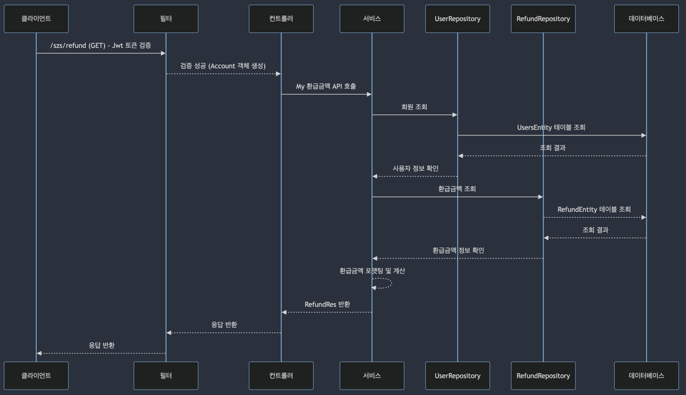

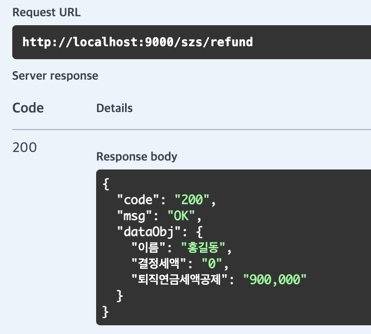
